#### **CSCI 1300 CS1: Starting Computing: Homework 0**
#### **Godley/Hoefer - Spring 2023**
#### **Due: Friday, January 20 by 6:00pm MST**

Zip file submission must be completed and submitted by Friday, January 20 by 6pm to recieve credit. 


# Table of contents

1. [Objectives](#objectives)
2. [Submission Instructions](#submit)
3. [Grading rubric](#grading)


# Objectives <a name="objectives"></a>

1. [Set up VSCode](#setup)
2. [Learn essential Linux commands](#linux)
3. [Write your first C++ program](#firstprogram)


## 1. Setup VSCode <a name="setup"></a>
In recitation today, you will be getting started with [Visual Studio Code](https://cs1300.csel.io) (VS Code), a cloud-hosted development environment we’ll use throughout the semester. Follow the steps below to familiarize yourself with the environment. If you need help, ask your TA or one of the LAs (You can post on **Edstem** as well, our class discussion forum).

You can find the links to the VSCode Setup Guides on Canvas under the assignment “Homework 0”. We will be using the cloud-hosted version of VS Code for this class, although you may follow the guide to install a local (no internet) version of VS Code if you desire. For a local installation, choose the guide corresponding to your operating system. Windows users will also need to install Windows Subsystem for Linux (WSL).


## 2. Learn how to use Terminal <a name="linux"></a>
In Visual Studio Code, you can open an integrated terminal, which initially starts at the root of your workspace. But what is a terminal?

A **terminal** is an **interface** to your computer which allows you to **execute any task on the computer** directly through **commands, without the use of a graphical user interface or GUI** (like the file explorers on your system that you use to navigate to folders, create files etc). This allows you to directly execute tasks, which is often quicker than using the GUI.

1. First, open VSCode. Visit [cs1300.csel.io](https://cs1300.csel.io) and log in with your Identikey credentials. Select the VS Code IDE button. Your screen may look a bit different from the screenshots below, but that's okay.

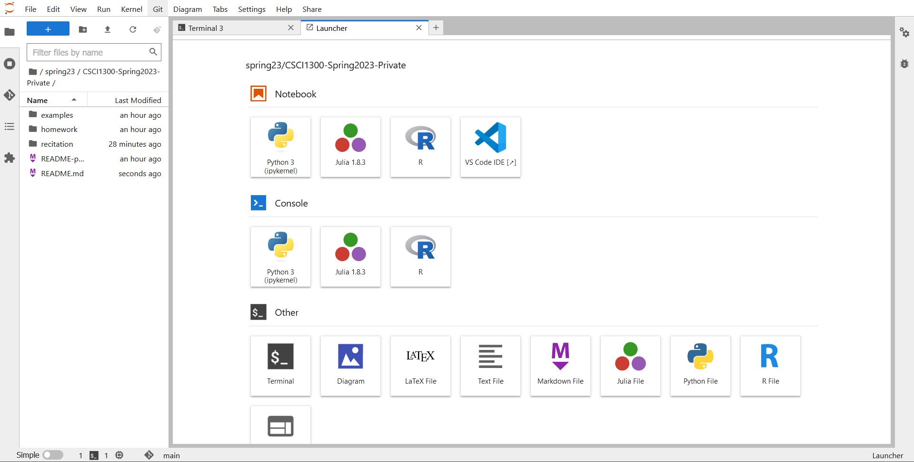
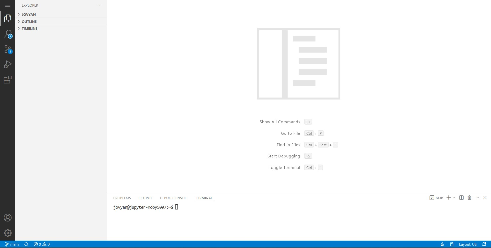

2. In VSCode, click on the Open Folder icon (it will look like a little folder with a plus icon) and give your folder a name, like "csci1300". 

The folder name is up to you. Try not to include spaces in your folder's name; spaces will make it harder to navigate to your folder when we begin using the terminal.

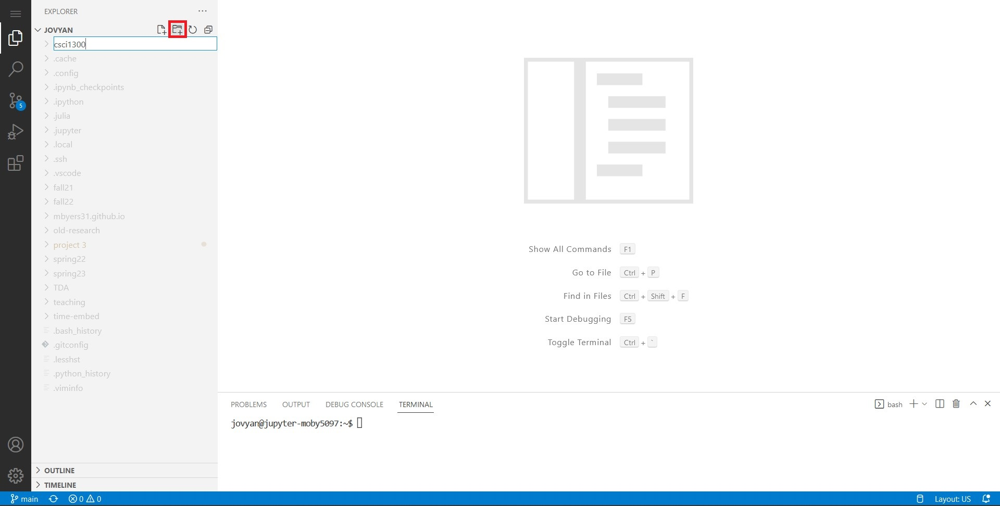

To open the Terminal, go to the menu (three horizontal lines on the top left of your screen), locate Terminal and click on it. Select "New Terminal" to open a new terminal. The terminal will open at the bottom of your screen. Opening a terminal this way will take you to your **home directory**. Directory is another term for folder. To open up the csci1300 folder we just created, you can either use the `cd csci1300` command in the terminal, or you can right click on the csci1300 folder and choose the "Open in integrated terminal" option. We will talk more about using the `cd` command below.

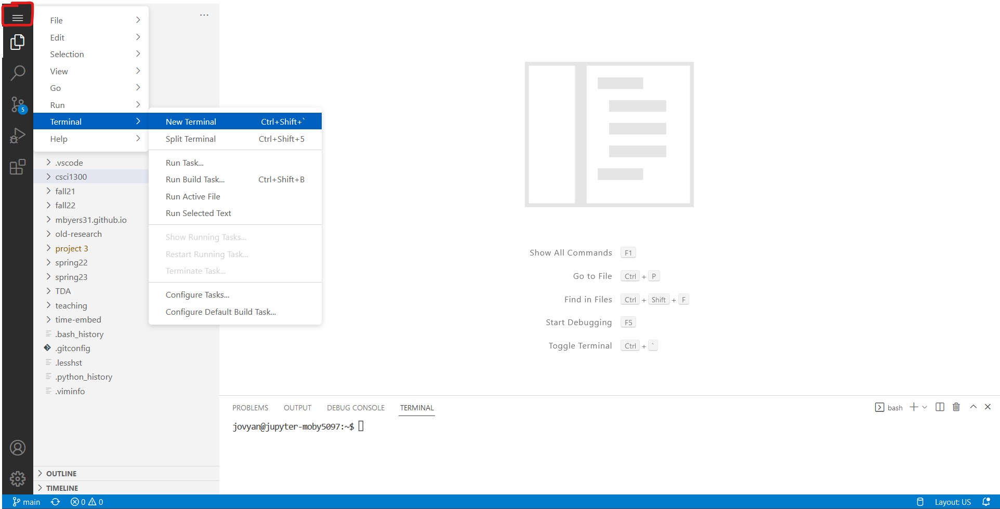
 
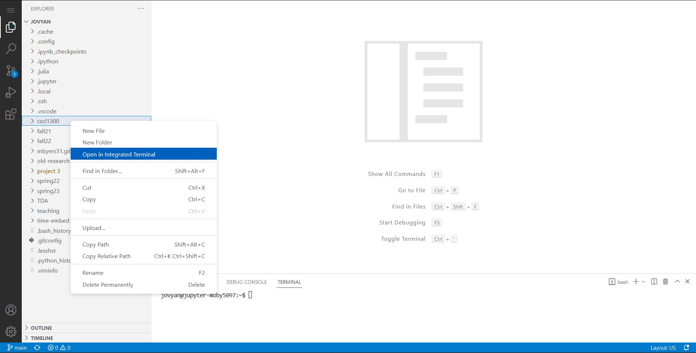

You will see your name and your device name on the terminal tab. Note that this can look different depending on your operating system. 

In general
1. Everything before the `:` tells you the username and the device name you’re logged in
2. Everything between the `:` and `$` is your current directory (think of a directory as the folder you’re in). Note that you do not need to be in the same directory as the screenshots shown above. Yours will depend on your computer.
 a. For Mac/Linux/Cloud it is represented as `~....$`.  `~` is shorthand for the current user's home directory.
 b.	For Windows, it is represented as `/mnt/c/Users/...$`. 
 Note that both are equivalent, they’re just different ways of showing the path to the current directory.
3. `$` represents the end of the prompt, after which you can enter a command.

File browsing using the terminal is like using Windows explorer/Finder or clicking on folders and navigating to different folders on your machine.

In the terminal, instead of clicking on folders we use text commands to tell the computer what we want. If we want to go to a folder where we saved our last homework, we can type the commands to navigate to that folder and display its contents.

### Some terminal commands

Below is a reference list of some common terminal commands. We will be working with some of these commands later on in this assignment.

```
ls -- list directory contents
```

`ls` = (that’s a lowercase “L”, not an uppercase “i”) stands for list and is used to ‘list’ or show you everything in the current directory.

Note:  after you type the command and press ENTER, a list of files and directories in your current directory is displayed as a result of the command, and then the prompt returns for you to enter other commands. If your folder is empty, nothing will be displayed.

---


```
mkdir -- make directory
```

To create a new directory, use the command `mkdir my_folder_name`
Note: Spaces are troublesome on the command line, so we’ll use underscores.  

---


```
cd -- change the working directory
```

`cd` = stands for change directory and is just like changing folders. Commonly used like `cd name_of_directory`. 
* Note that there will always be a space between cd and the name of the directory that you want to navigate to.
* Note: cd takes you places in reference to your current location. It’s like going into a folder, and then clicking on a folder within that folder, and then clicking on another folder within that folder. You will always navigate deeper within that folder. 
* The command `cd ..` means go to the parent of my current location. It’s essentially backing up one folder.
* Note: cd (and other commands) is case sensitive. `hw0` does not equal `Hw0`. Make sure you type in directory names exactly as they are spelled.


## 3. Create a Hello World program <a name="firstprogram"></a>
The "Hello, World!" program is one of the simplest programs in a programming language, and it is often used to illustrate the basic syntax of a programming language. We will need to first create a folder to store our program file in and then create the file to write the program. 

1. After you open VSCode as shown in Section 2.2, you will see your new csci1300 folder on the left hand side of your screen.

2. We now need to create a new folder within the csci1300 folder we just opened, called `hmwk0`. Click on your csci1300 folder. Find the "create folder" button you used previously and click on it.

Note that you need to have your csci1300 folder selected so that we can put our hmwk0 folder inside of the csci1300 folder.

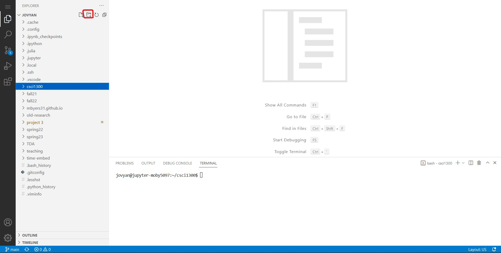

3. An entry opens up. Type `hwmk0` and hit Enter.

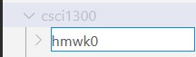

4. We now need to create our program file. Select your newly created hmwk0 folder and click the "New File" icon at the top of the file explorer pane.

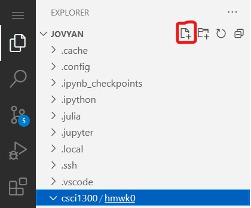

5. Save your file. Important: The filename should be named with lower *camelCase* (the first letter of the word in a compound word is lowercase and the first letter of subsequent words are capitalized) and end with .cpp. 

Your file name should be `helloWorld.cpp`.

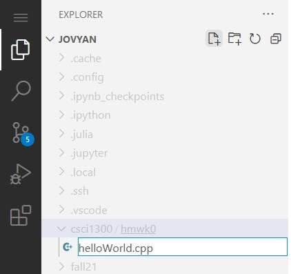

6. Type the following code into your file.
```cpp
#include <iostream>

int main() {
    std::cout << "Hello, world!" << std::endl;
}
```
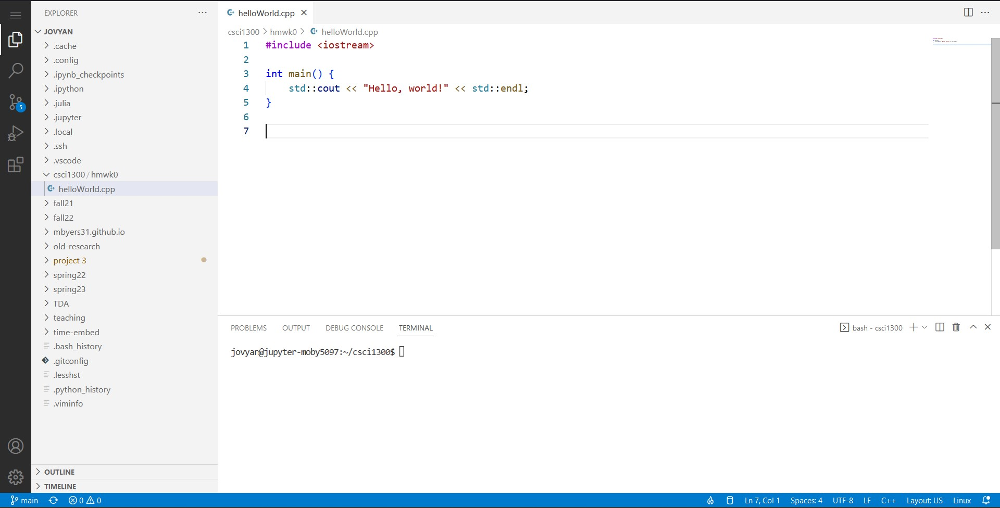

7. **Save** your file, then run your program through the terminal as described below. A quick shortcut to save is **Cmd + S** (In Mac) or **Ctrl + S** (in Windows)

---

### Running a program in terminal
When you open VSCode at the bottom of the screen you should see a terminal. If not, you can open a terminal by following the steps above.

In order to compile and run your code you first need to navigate to where your code is saved through the terminal. The easiest way to do this is by right clicking the folder you want to open and selecting "Open in Integrated Terminal". If you open up a terminal directly (Terminal > New Terminal), then you will be taken to your home directory.

You can visualize your location using `pwd` (print working directory).

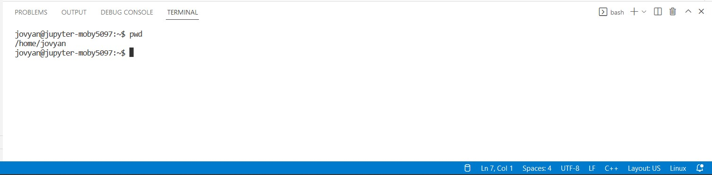

Let’s say that the code you want to run is located in your csci1300/hmwk0 directory (it can differ for your system!). Our helloWorld.cpp file is under the `hmwk0` subdirectory. If it’s not, make sure it’s moved to the `hmwk0` directory. You can see the contents of your current (working) directory by typing `ls`.

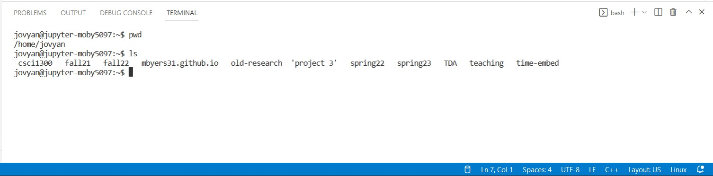

Navigate to hmwk0 using the `cd` command we saw before (as in the screenshot below). We can verify we’re in the correct directory using `ls` again. You may need to navigate several folders deep (for instance, you may need to first enter your csci1300 folder before entering your hmwk0 folder).

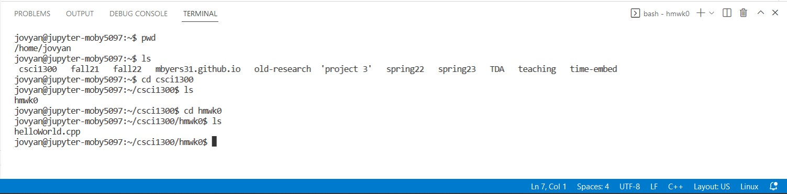

Now to compile our code we use the program g++ in the following command.
```
g++ -std=c++17 helloWorld.cpp 
```

`g++` is the compiler program

`-std=c++17` specifies the version of C++ we want to use

`helloWorld.cpp` is the file we want to compile

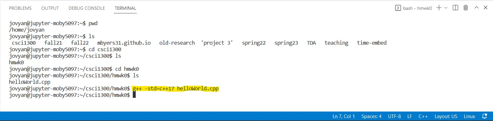

This command creates a file named `a.out` which is the compiled version of the code in `helloWorld.cpp`, which can be executed. Now to execute our code we run `a.out` by typing the following and hitting enter.

`./a.out`

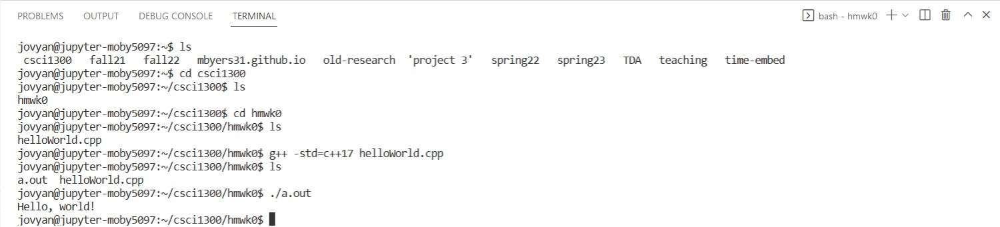

If you get the output as the above, you’ve successfully run the program! And that is how you compile and run a C++ program from a terminal.

---

8. Let’s modify our program a bit. Add a statement to use the [standard namespace](https://www.tutorialspoint.com/cplusplus/cpp_namespaces.htm). Insert `using namespace std;` at the beginning of the code, then we can remove the `std::` prefixes. Run the program again using the steps above.

Note: Every time you make changes to the program and want to run it again, you need to re-compile your program (follow the steps above). 

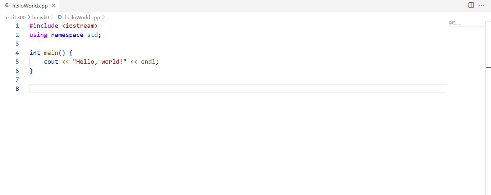

9. Let’s modify the file to print “Hello world! Hello CSCi 1300”. The text inside of the quotation marks is printed as it is. It’s case sensitive too! To see the updated output, compile and run again.

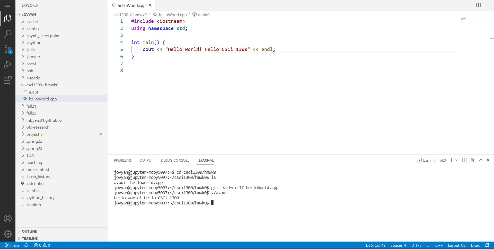

Congratulations! You’ve implemented your first C++ program! 

You will learn more C++ syntax over the semester to build your programming and problem-solving skills. Here is a snapshot of your program (from the class textbook: Brief C++: Late Objects, Enhanced eText; we recommend you check it out). 

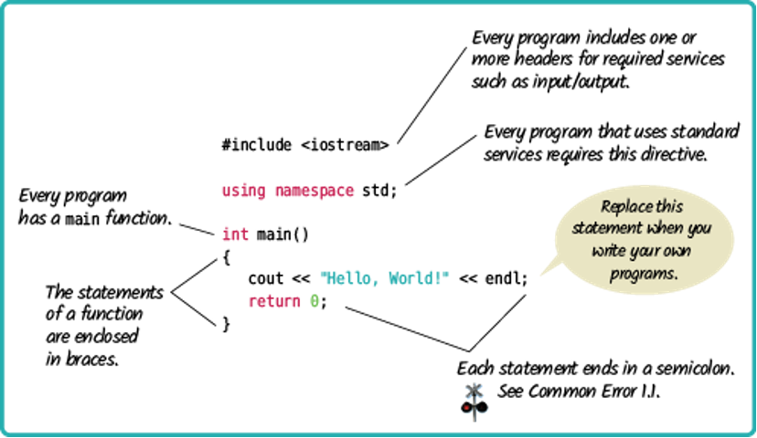

## Advanced Terminal commands
Now that you’ve learned the basic commands, here are some additional commands you can try out:

```
cp -- copy files
```
(**Note** Be very careful not to overwrite a file when copying.)
1. First, right click the file `helloWorld.cpp`. Choose "Save As" and, when the dialog box opens, change the name of the file to `hello1300.cpp`. Choose hmwk0  as the destination folder (this should be the destination folder by default).

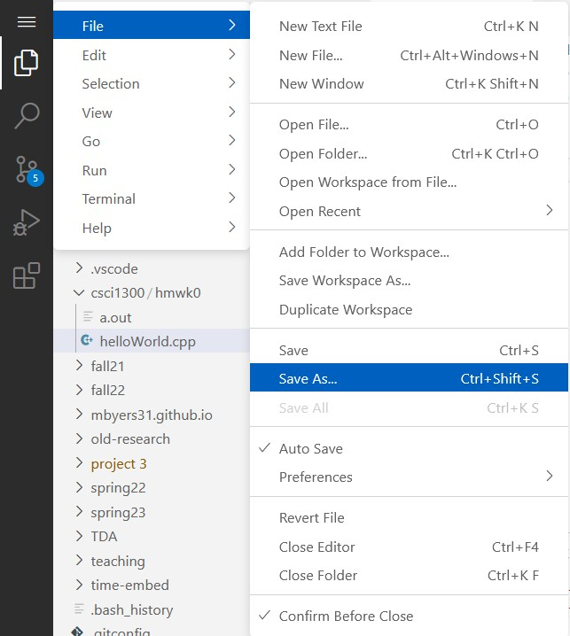

2. Once you click Save, the new file will appear in the explorer tab, to the left side of the window.

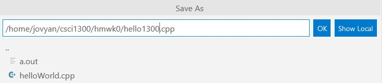

3. Let’s make another directory named hmwk1. Make sure you are in your csci1300 folder when you run this command.
```
$ mkdir hmwk1
```

4. Now we want to copy the file from `hmwk0` into `hmwk1`. First, we go into the hmwk0 directory:
```
$ cd hmwk0
```

5. Now we use the command for copying files:
```
$ cp hello1300.cpp hello1300v2.cpp
```

6. Now let’s type `ls` and see what we have:
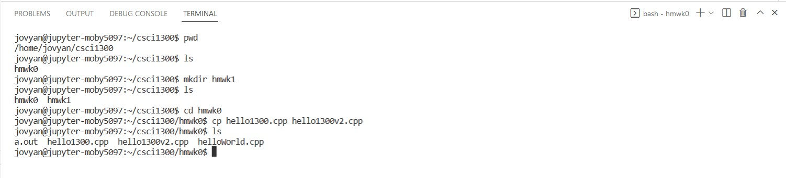

Since we did not tell the computer where to put our copy, the computer put our copy inside the `hmwk0` folder.

7. Let’s do this again, including the path:
```
$ cp hello1300.cpp ../hmwk1/hello1300v3.cpp
```

Notice that our file explorer is also updating, to give us a visual idea of where our files are. The indentation represents which files are inside of what folders. 
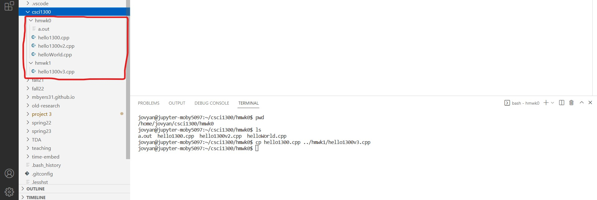

8. If your terminal window is full, you can always `clear` it. You can type the command “clear” OR right-click anywhere within the terminal, and choose “Clear”. 
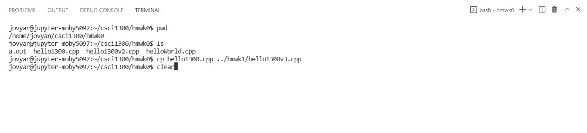


---


```
mv -- move files
```
It’s possible to move files around using the command `mv`.  Starting in directory `hmwk0`, type:
```
$ mv hello1300.cpp ..
```

Remember, two dots indicate the parent directory (one level up).  Now if we list the files in `hmwk0`, there is only `hello1300v2.cpp` left. And we have moved the file `hello1300.cpp` up in the root directory:

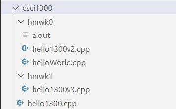

Let’s move one more file into the hw1 directory:

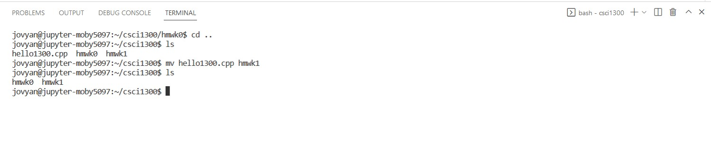


---


```
Downloading files to your local machine
```

An important thing to know for this class is how to download your files to your own computer so that you may submit them to Canvas and keep a backup copy for yourself. To download a file, right click the file name on your file explorer and select the "Download" option.

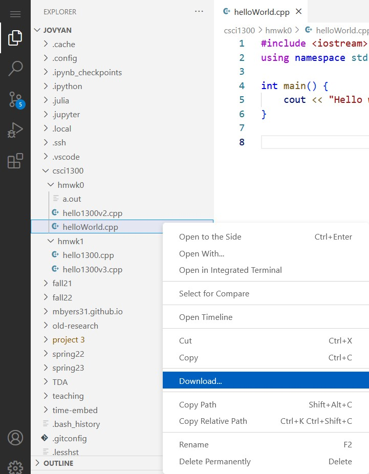

---

### Linux commands we've learned
Here are the six useful Linux commands we just practiced:
* `ls`: List directory contents. Use this command to see the list of files and folders in the current directory. 
* `mkdir`: Make directories. Create a new directory (folder). 
* `cd`: Change directory. Use this command to change the current directory (move to another folder) 
* `cp`: Copy a file 
* `mv`: Move a file 
* `clear`: Clears your terminal output for a clean view.

### Fun tips and tricks
* Tab Complete: if you're typing something in the command line that’s very long, but unique, you can hit tab when you're partially through and it will try to fill in the rest (kind of like autocomplete). If it doesn't, and you press tab twice, it tells you everything it has as options.
* Command history browsing: if you have typed a command (e.g. `gedit myFile.txt`) and want to repeat it, just press the up arrow. It will bring up your last executed command. Pressing up again will go to the one before. Pressing down will go forward in time through the list. 

**Want to learn more about Linux commands?**
http://community.linuxmint.com/tutorial/view/244 has a list of categorized Linux commands. 
Codecademy also has a course covering the command line (https://www.codecademy.com/learn/learn-the-command-line). 

## Back up often
It’s a good idea to create a backup of your workspace. Backing up a file only takes a few seconds. You will hate yourself if you lose hours of work before the deadline. We recommend that you backup your work once every thirty minutes by downloading your work to your local computer. 

### Your computer 
It’s important to backup your computer in case your computer gets broken or your dog eats your laptop. You can use: 
* Dropbox 
* Google Drive 
* Github (be sure to use a Private repository. You can get free private repository via GitHub Student Developer Pack) 

Simply upload your entire workspace (ie, the folder all of your .cpp files are in) to your online file storage provider of choice. Note that since we are using a cloud-hosted environment for this class, your work will always be saved on the cloud. It's still a good idea to make a local copy of your work regularly in case of internet issues. 

# Submission Instructions <a name="submit"></a>

### Screenshot
We would like to make sure that you are comfortable working with VS Code. Take a screenshot of the window for VSCode, and name it `VSCode.png` (or `VSCode.jpg`). This screenshot can be of VS Code in your browser or a local installation of VS Code. 

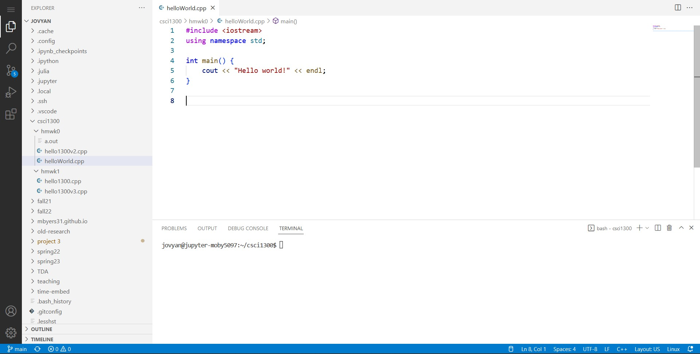

### Zip your submission file
Download your `helloWorld.cpp` file from the cloud-hosted VS Code platform (right click > "Download"). Put it in the same folder as where your took your screenshot and create a zip file with both your screenshot and your cpp file. If your last name is Smith, then the name of the zip file should be `hmwk0_Smith.zip`. 

How to zip up files:
* [Windows](https://support.microsoft.com/en-us/windows/zip-and-unzip-files-8d28fa72-f2f9-712f-67df-f80cf89fd4e5)
* [Mac](https://support.apple.com/guide/mac-help/zip-and-unzip-files-and-folders-on-mac-mchlp2528/mac)

### Submit to Canvas
Once you create the zip file, go to Homework 0 on Canvas, click “add submission”. Use the “choose file” option to upload your zip file and click “submit assignment”. You can add comments as well, if you need to convey something with respect to the current HW. Once your file is uploaded, we recommend downloading it and unzipping your file to make sure you submitted everything correctly.

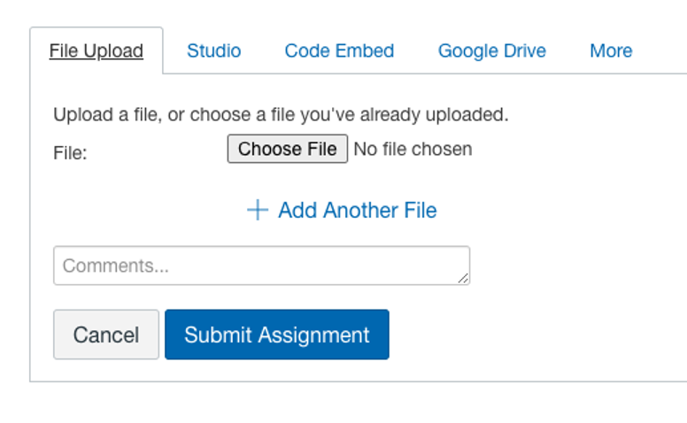


---
   

# Grading Rubric <a name="grading"></a>
| **Criteria**                                                | **Pts** |
| ----------------------------------------------------------- | ------- |
| Zip file submission with .cpp and .png files inside         | 10      |
| Recitation attendance (the week of January 16th)*           | -1      |
| Total                                                       | 10      |

**Note:** if your attendance is not recorded, you will lose points as mentioned in the above table. Make sure your attendance is recorded. 
